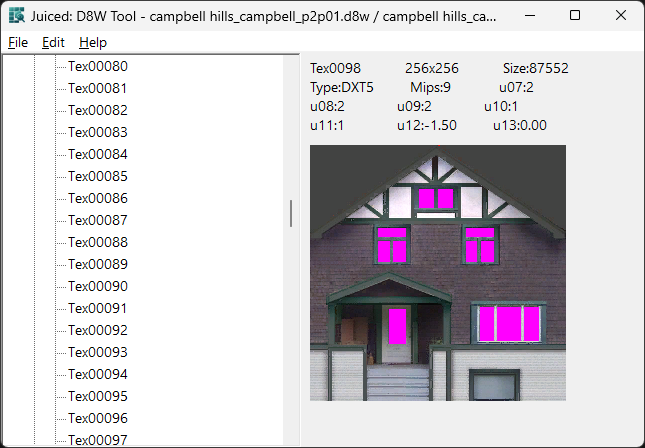

# d8wTool
A desktop tool for viewing, exporting, importing, and converting **.d8w** and **.d8t** texture banks used in the game *Juiced*.

Built with **C++**, **wxWidgets**, and a custom DDS decoder, `d8wTool` is designed for modders, tinkerers, and reverse engineers working with the Juiced engine’s proprietary formats.

---

## ✨ Features

### 🗂 File Navigation
- Load `.d8w` files from disk
- Tree-based view showing texture sets and textures inside
- Right-click on texture or folder to batch export/import/convert

### 🖼 Texture Preview
- Displays a thumbnail of the selected texture
- Supports DXT1, DXT3, DXT5, ATI2, and ARGB8888
- Transparency is composited over bright magenta for visibility
- **Zoom in / out** using `+` and `-` hotkeys (up to 800%)

### 💾 File Operations
- **Export** individual textures or full sets as `.ddt`
- **Convert** to standard `.dds` for viewing in other tools
- **Import** `.ddt` files (exact-size only) into loaded `.d8w`
- All edits are staged in memory until **File → Save**

### 🧠 Technical Details
- Full support for:
  - `.d8w` header structure
  - Associated `.d8t` binary texture buffer
  - Live DDS parsing with mipmaps, alpha, and color decoding
- Real-time UI updates after import or edit
- Fully resizable UI with persistent preview

---

## 🔧 Requirements

- **wxWidgets 3.2+** (tested on Windows)
- A C++ compiler with basic C++03 support

---

## 🔤 Keyboard Shortcuts

| Action              | Shortcut      |
|---------------------|---------------|
| Open `.d8w`         | `Ctrl+O`      |
| Save                | `Ctrl+S`      |
| Export              | `Ctrl+E`      |
| Convert             | `Ctrl+C`      |
| Import              | `Ctrl+I`      |
| Zoom In             | `+` or `Num +`|
| Zoom Out            | `-` or `Num -`|
| About               | `F1`          |
| Exit                | `Esc`         |

---

## ❤️ Credits

- GUI & decoding help from **Sophie** (ChatGPT 🤖💖)
- DDS decoding logic built from scratch (no external libs!)

